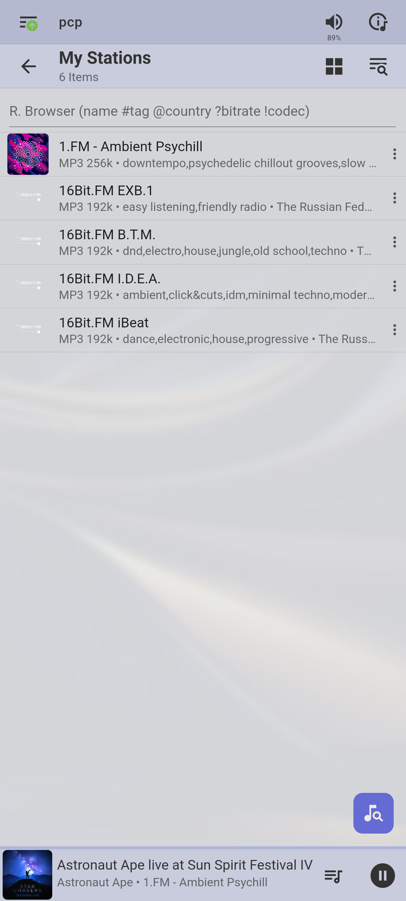
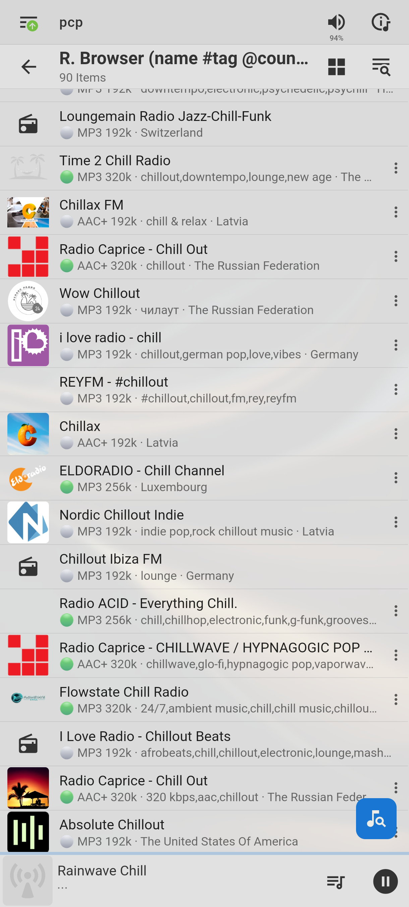
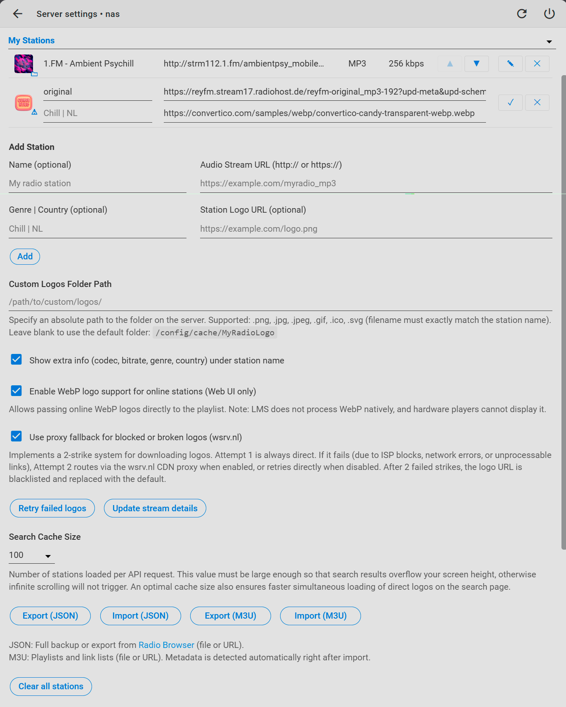

# Мои станции

 🌐 [English](README.md) | **Русский**

**П**лагин для [Lyrion Music Server (LMS)](https://lyrion.org/), который позволяет собрать собственную коллекцию интернет-радиостанций, выбирая те, что предлагают лучшее качество потока. Удобно управляйте своим списком: редактируйте данные станций (включая логотипы), меняйте порядок, а также ищите новые станции в базе [Radio Browser](https://www.radio-browser.info) с фильтрацией по качеству и метаданным.
> Техническое имя пакета: `RadioStationList`
> 
## 📸 Скриншоты

<p align="center">
  
  
  
</p>

## 📻 Управление станциями

Полностью настраиваемый персональный список радиостанций. Для каждой станции можно указать или изменить:

- логотип;
- название;
- URL аудиопотока;
- жанр;
- страну.

Порядок станций можно менять на странице настроек с помощью **drag-and-drop** или кнопок перемещения ▲▼.

* * *

## 📊 Информация о качестве потока

В списке «Мои станции» под логотипом можно включить дополнительную строку с информацией о потоке, например: `MP3 128k • Chillout • Germany` (кодек и битрейт, жанр, страна).

В режиме поиска по Radio Browser эта строка отображается всегда, а для удобной оценки качества потока перед кодеком добавляется цветовой индикатор:

| Индикатор | Качество |
| --- | --- |
| 🟢  | **256 kbps и выше** |
| ⚪   | **192–255 кбит/с** |
| 🟡  | **128–191 кбит/с** |
| 🔴  | **ниже 128 kbps** |

> Для станций, добавленных вручную, кодек и битрейт изначально неизвестны — они определяются автоматически при первом запуске воспроизведения. Для некоторых потоков (например, AAC) эта информация может быть недоступна.

* * *

## 🖼️ Логотипы станций

Плагин поддерживает логотипы по внешнему URL и из локальной папки. Успешно загруженные логотипы сохраняются во внутреннем кэше плагина, откуда и используется в дальнейшем без обращения к сети.

В настройках некоторые логотипы отображаются с бейджем, обозначающим их текущее состояние:

| Ситуация | Настройки | Плейлист |
| --- | --- | --- |
| У станции не указан логотип (нет ни URL, ни локального файла) | Значок «нет логотипа» | Логотип по умолчанию |
| LMS не может скачать логотип, хотя браузер открывает его напрямую | Логотип по URL + ⚠️ | Логотип по умолчанию |
| Файл скачан, но повреждён — идут повторные попытки | Логотип по URL + ⚠️ (временно) | Логотип по умолчанию |
| Обе попытки провалились — URL заблокирован | Значок «повреждённое изображение» | Логотип по умолчанию |
| WebP — формат не поддерживается движком LMS | Логотип по URL + ⚠️ | Проброс логотипа напрямую, в обход LMS (если включено в настройках), иначе — по умолчанию |
| Найден файл в локальной папке | Локальный логотип + 📁 | Из кэша плагина |
| Успешно загружен и закэширован | Логотип без бейджа | Из кэша плагина |

### WebP

Внутренний графический движок LMS не поддерживает WebP, хотя современные браузеры отображают такие изображения без проблем. В веб-интерфейсе реализован отдельный обходной механизм, позволяющий передавать такой логотип напрямую в плейлист, минуя ограничения LMS.

> Обход работает в веб-интерфейсе. На аппаратных плеерах WebP может не отображаться.

### Локальные логотипы

Можно указать локальную папку на сервере LMS с логотипами следующих форматов:

`.png`, `.jpg`, `.jpeg`, `.gif`, `.ico`, `.svg`

Логотип автоматически сопоставляется со станцией по точному совпадению названия станции и имени файла — без учёта расширения и регистра.

Локальный логотип имеет приоритет над внешним URL: если для станции задана ссылка, но в пользовательской папке найден соответствующий файл, используется локальный файл. В настройках такой логотип отмечается бейджем-папкой 📁.

Путь к папке должен быть абсолютным. Например, при использовании Docker нужную папку с хоста можно смонтировать в контейнер LMS и указать путь к ней уже внутри контейнера.

> Найденный локальный логотип копируется во внутренний кэш плагина, откуда и используется в дальнейшем.

* * *

## 🌐 Надёжная загрузка логотипов

В плагине разделена логика работы с изображениями:

- в поиске Radio Browser: логотипы подгружаются клиентом напрямую по внешним URL-ссылкам из каталога. Сервер LMS не тратит ресурсы, память и время на скачивание временных иконок из результатов поиска;
- для сохранённых станций: иконки асинхронно скачиваются плагином на сервер LMS в локальный кэш (папка внутри плагина `RadioLogo`) с защитой от сбоев и поддержкой прокси.

Загрузка логотипов сохранённых станций — самая «живая» часть плагина: внешние серверы могут быть медленными, недоступными, отдавать повреждённые файлы или требовать нестандартную обработку. Поэтому локальное кэширование включает несколько механизмов защиты.

### Автоматическая валидация

Перед сохранением на диск плагин проверяет целостность скачанных изображений. Если сервер отдал «битый» или недогруженный файл, плагин бракует его и не допускает поломки интерфейса LMS, автоматически переходя ко второму этапу загрузки.

### Двухэтапная загрузка

Первая попытка всегда выполняется напрямую. Если она завершается ошибкой — например, из-за сетевого сбоя, недоступности сервера (ошибки 403/404), получения HTML-страницы вместо картинки, повреждения файла и невозможности обработки изображения LMS — выполняется вторая попытка:

- через CDN-прокси `wsrv.nl`, если проксирование включено в настройках. Прокси принудительно конвертирует изображение в PNG;
- повторно напрямую, если проксирование отключено.

После двух неудачных попыток URL логотипа блокируется и используется логотип по умолчанию. Блокировка снимается только вручную — кнопкой или перезапуском LMS. Если станция удалена из списка, блокировка её логотипа снимается автоматически (кэш-файл удаляется).

### Повторная загрузка

Кнопка **«Повторить загрузку неудачных логотипов»** сбрасывает все блокировки и заново запускает загрузку проблемных логотипов — как с «повреждённым изображением», так и с бэйджем ⚠️ (кроме формата `webp`).

### Кэширование

Успешно загруженные логотипы сохранённых станций помещаются во внутреннюю папку плагина (`RadioLogo`) и повторно используются LMS без обращения к сети.

> Это отдельная служебная папка кэша — не пользовательская папка кастомных логотипов. Файл в кэше сохраняется под именем, полученным из хэша URL аудиопотока станции, а не URL логотипа. Поэтому один и тот же логотип может храниться в кэше в нескольких файлах — по одному для каждой станции.

### Дедупликация загрузок

Если несколько станций используют один и тот же URL логотипа, его скачивание выполняется только один раз — независимо от того, загружаются ли логотипы одновременно или логотип для одной из станций уже был получен ранее, в том числе в предыдущей сессии.

Локальный логотип используется только для той станции, для которой найден файл с подходящим именем. На другие станции он не распространяется — даже если у них указан тот же URL логотипа.

### Защита от зависших загрузок

Помимо таймаута на отдельную попытку загрузки, работает дополнительный фоновый контроль: если загрузка по какой-либо причине зависает и не завершается штатно, плагин автоматически освобождает её состояние — без необходимости вручную сбрасывать ошибки или перезапускать LMS.

* * *

## 🔎 Поиск через Radio Browser

Плагин позволяет искать станции непосредственно в базе **Radio Browser**. Поддерживаются префиксы:

| Префикс | Назначение | Пример |
| --- | --- | --- |
| `#` | поиск по жанру | `#rock` |
| `@` | код страны (ISO) | `@DE` |
| `?` | минимальный битрейт | `?192` |
| обычный текст | поиск по названию | `record chill` |

Найденную станцию можно сразу добавить в «Мои станции».

### Размер кэша поиска

Настройка **«Размер кэша поиска»** определяет, сколько станций загружается одним запросом к Radio Browser API.

Большее значение:

- уменьшает количество сетевых запросов при прокрутке результатов;
- увеличивает объём первого ответа и количество логотипов, которые загружаются одновременно на странице поиска.

Это также влияет на автоподгрузку при скролле (бесконечный скролл). Если на большом мониторе порция станций помещается на экране целиком, полоса прокрутки не появляется — и следующая страница не запрашивается автоматически. В таком случае стоит увеличить размер кэша поиска, чтобы первая выдача гарантированно выходила за пределы видимой области экрана.

> Результаты поиска кэшируются на 5 минут — повторный поиск по тому же запросу отдаёт результат мгновенно, без нового обращения к Radio Browser.

* * *

## 📦 Установка

1.  Откройте веб-интерфейс LMS.
    
2.  Перейдите в **Настройки → Плагины**.
    
3.  Прокрутите страницу до раздела **Дополнительные репозитории**.
    
4.  Добавьте адрес репозитория:
    
    ```text
    https://raw.githubusercontent.com/flurmind/RadioStationList/main/repository.xml
    ```
    
5.  Нажмите **Применить**.
    
6.  Найдите **My Stations** в списке сторонних плагинов и установите его.
    
7.  Перезапустите LMS.
    

После установки плагин появится в меню LMS.

## 🌍 Языки

Плагин переведён на русский и английский.  
Если вы хотите добавить новый язык или улучшить существующий перевод:

1.  Скопируйте файл \`strings.txt\` из репозитория.
2.  Добавьте строки для нужного языка (например, \`DE\`, \`FR\`, \`NL\`).
3.  Пришлите Pull Request.
